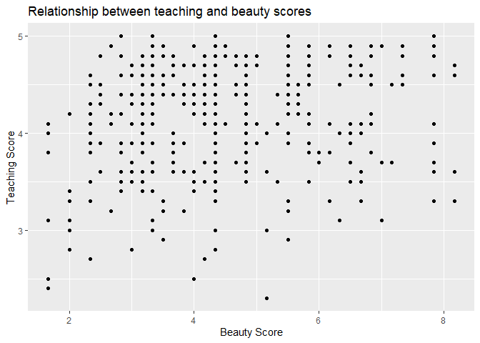
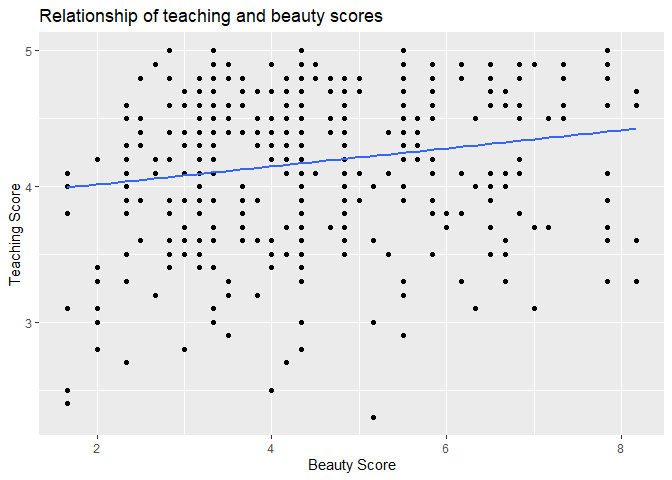

My Report
================
Shuqi Cao
2021/6/12

# Simple linear regression with one numerical explanatory variable

## Exploratory data analysis

``` r
evals.scores <- evals %>% select(score, bty_avg)
evals.scores
```

    ## # A tibble: 463 x 2
    ##    score bty_avg
    ##    <dbl>   <dbl>
    ##  1   4.7    5   
    ##  2   4.1    5   
    ##  3   3.9    5   
    ##  4   4.8    5   
    ##  5   4.6    3   
    ##  6   4.3    3   
    ##  7   2.8    3   
    ##  8   4.1    3.33
    ##  9   3.4    3.33
    ## 10   4.5    3.17
    ## # ... with 453 more rows

## Correlation

``` r
evals.scores %>% 
  get_correlation(formula = score ~ bty_avg)
```

    ## # A tibble: 1 x 1
    ##     cor
    ##   <dbl>
    ## 1 0.187

``` r
ggplot(evals.scores, aes(x = bty_avg, y = score)) +
  geom_point() +
  labs(x="Beauty Score",y="Teaching Score",
       title="Relationship between teaching and beauty scores")
```

<!-- -->

## Formal Analysis

``` r
model <- lm(score ~ bty_avg, data = evals.scores)
model
```

    ## 
    ## Call:
    ## lm(formula = score ~ bty_avg, data = evals.scores)
    ## 
    ## Coefficients:
    ## (Intercept)      bty_avg  
    ##     3.88034      0.06664

``` r
ggplot(evals.scores, aes(x = bty_avg, y = score)) +
  geom_point() +
  labs(x = "Beauty Score", y = "Teaching Score", 
       title = "Relationship of teaching and beauty scores") +
  geom_smooth(method = "lm", se = FALSE)
```

    ## `geom_smooth()` using formula 'y ~ x'

<!-- -->

``` r
regression.points <- get_regression_points(model)
regression.points
```

    ## # A tibble: 463 x 5
    ##       ID score bty_avg score_hat residual
    ##    <int> <dbl>   <dbl>     <dbl>    <dbl>
    ##  1     1   4.7    5         4.21    0.486
    ##  2     2   4.1    5         4.21   -0.114
    ##  3     3   3.9    5         4.21   -0.314
    ##  4     4   4.8    5         4.21    0.586
    ##  5     5   4.6    3         4.08    0.52 
    ##  6     6   4.3    3         4.08    0.22 
    ##  7     7   2.8    3         4.08   -1.28 
    ##  8     8   4.1    3.33      4.10   -0.002
    ##  9     9   3.4    3.33      4.10   -0.702
    ## 10    10   4.5    3.17      4.09    0.409
    ## # ... with 453 more rows
